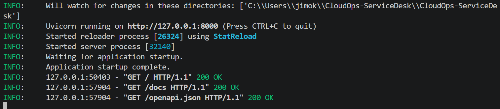
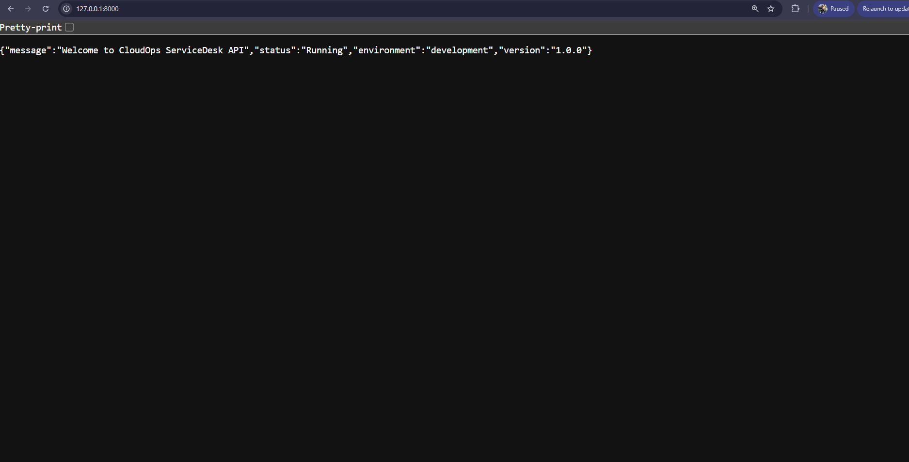
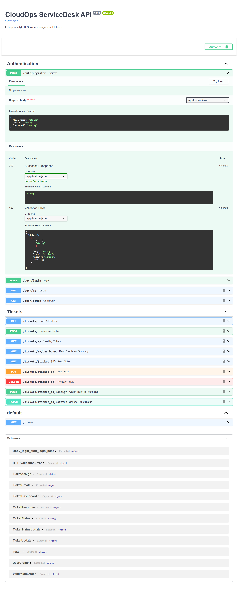

# Screenshots

# 1. Introduction

This document provides visual evidence of the implementation and evolution of CloudOps ServiceDesk.

Each screenshot captures a completed project milestone or feature and is accompanied by a brief explanation describing its purpose and significance.

As development progresses, this document will continue to expand, providing a complete visual history of the platform from backend development through to enterprise production deployment.

---

# 2. Backend Foundation

## 2.1 FastAPI Startup

**Purpose**

Demonstrates the successful startup of the FastAPI application using the Uvicorn ASGI server. The application has completed initialization and is ready to accept incoming HTTP requests.

**Screenshot**

---

## 2.2 Home Endpoint

**Purpose**

Demonstrates that the application is running correctly by successfully responding through the root endpoint. The response confirms the application status, environment, and current version.

**Screenshot**

---

## 2.3 Swagger API Documentation

**Purpose**

Displays the automatically generated OpenAPI (Swagger UI) documentation, including authentication endpoints, ticket management endpoints, request schemas, response models, and interactive API testing capabilities.

**Screenshot**

---

# 3. Authentication

## 3.1 User Registration

**Purpose**

Demonstrates successful user registration through the API.

**Screenshot**

_To be added after implementation._

---

## 3.2 User Login

**Purpose**

Demonstrates successful user authentication and JWT access token generation.

**Screenshot**

_To be added after implementation._

---

## 3.3 Current User Profile

**Purpose**

Demonstrates successful authentication using a Bearer Token and retrieval of the authenticated user's profile information.

**Screenshot**

_To be added after implementation._

---

# 4. Ticket Management

## 4.1 Create Ticket

**Purpose**

Demonstrates the creation of a new IT support ticket.

**Screenshot**

_To be added after implementation._

---

## 4.2 View Tickets

**Purpose**

Demonstrates retrieval of ticket records from the database.

**Screenshot**

_To be added after implementation._

---

## 4.3 Assign Ticket

**Purpose**

Demonstrates an administrator assigning a support ticket to a technician.

**Screenshot**

_To be added after implementation._

---

## 4.4 Ticket Dashboard

**Purpose**

Demonstrates dashboard statistics and ticket summary information.

**Screenshot**

_To be added after implementation._

---

# 5. Database

## 5.1 PostgreSQL Database

**Purpose**

Demonstrates the PostgreSQL database containing the project tables and stored records.

**Screenshot**

_To be added after implementation._

---

## 5.2 Alembic Migration

**Purpose**

Demonstrates successful database schema migration using Alembic.

**Screenshot**

_To be added after implementation._

---

# 6. Future Milestones

The following screenshots will be added as the project progresses through future implementation milestones.

## 6.1 Docker

_To be added._

---

## 6.2 Docker Compose

_To be added._

---

## 6.3 Redis

_To be added._

---

## 6.4 Celery

_To be added._

---

## 6.5 Terraform

_To be added._

---

## 6.6 Ansible

_To be added._

---

## 6.7 Amazon Web Services (AWS)

_To be added._

---

## 6.8 GitHub Actions

_To be added._

---

## 6.9 Kubernetes

_To be added._

---

## 6.10 Prometheus

_To be added._

---

## 6.11 Grafana

_To be added._

---

## 6.12 Loki

_To be added._

---

## 6.13 Production Deployment

_To be added._

---

# 7. Screenshot Standards

Every screenshot included in this document should:

- Be clear, readable, and high resolution.
- Display only the relevant feature or implementation.
- Follow the project's screenshot naming convention.
- Reflect the latest implementation.
- Include a short purpose describing what the screenshot demonstrates.

---

# 8. Related Documentation

- 16-Project-Status.md
- 17-Roadmap.md
- 19-Getting-Started.md

---

# 9. Revision History

| Version | Description |
|----------|-------------|
| 1.0 | Initial screenshots documentation created. |
| 1.1 | Backend Foundation screenshots added. |

---

# 10. Document Status

Completed