# Screenshots

# 1. Introduction

This document provides visual evidence of the implementation and evolution of CloudOps ServiceDesk.

Each screenshot captures a completed project milestone or feature and is accompanied by a brief explanation describing its purpose and significance.

As development progresses, this document will continue to expand, providing a complete visual history of the platform from backend development through to enterprise production deployment.

---

# 2. Backend Foundation

## 2.1 FastAPI Startup

**Purpose**

Demonstrates the successful startup of the FastAPI application using the Uvicorn ASGI server. The application completed initialization successfully and is ready to receive HTTP requests.

**Screenshot**

---

## 2.2 Home Endpoint

**Purpose**

Demonstrates that the CloudOps ServiceDesk API is running correctly by successfully responding through the root endpoint. The response confirms the application status, execution environment, and current API version.

**Screenshot**

---

## 2.3 Swagger API Documentation

**Purpose**

Displays the automatically generated OpenAPI (Swagger UI) documentation, including Authentication endpoints, Ticket Management endpoints, request schemas, response models and interactive API testing capabilities.

**Screenshot**

---

# 3. Authentication

## 3.1 User Registration

**Purpose**

Demonstrates successful user registration through the API.

**Screenshot**

_To be added after implementation._

---

## 3.2 User Login

**Purpose**

Demonstrates successful user authentication and JWT access token generation.

**Screenshot**

_To be added after implementation._

---

## 3.3 Current User Profile

**Purpose**

Demonstrates successful authentication using a Bearer Token and retrieval of the authenticated user's profile information.

**Screenshot**

_To be added after implementation._

---

# 4. Ticket Management

## 4.1 Create Ticket

**Purpose**

Demonstrates the creation of a new IT support ticket.

**Screenshot**

_To be added after implementation._

---

## 4.2 View Tickets

**Purpose**

Demonstrates retrieval of ticket records from the PostgreSQL database.

**Screenshot**

_To be added after implementation._

---

## 4.3 Assign Ticket

**Purpose**

Demonstrates an administrator assigning a support ticket to a technician.

**Screenshot**

_To be added after implementation._

---

## 4.4 Ticket Dashboard

**Purpose**

Demonstrates dashboard statistics and ticket summary information.

**Screenshot**

_To be added after implementation._

---

# 5. Database

## 5.1 PostgreSQL Database

**Purpose**

Demonstrates the successful deployment of the PostgreSQL database inside a Docker container. The screenshot shows the `cloudops_db` database connected through pgAdmin with the project schema available for application use.

**Screenshot**

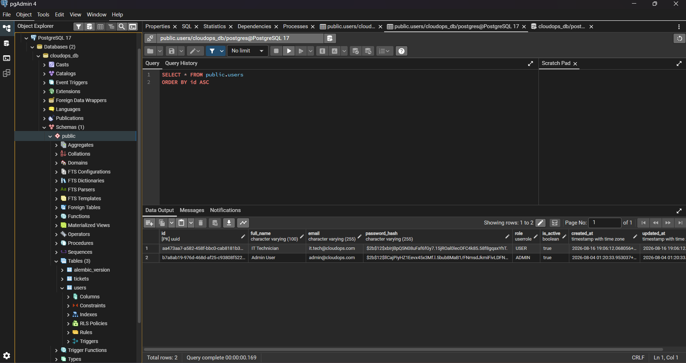

---

## 5.2 Alembic Migration

**Purpose**

Demonstrates successful database schema migration using Alembic.

**Screenshot**

_To be added after implementation._

---

# 6. Containerization and Infrastructure

## 6.1 Docker Compose

**Purpose**

Demonstrates the successful deployment of the complete CloudOps ServiceDesk multi-container platform using Docker Compose. The deployment includes FastAPI, PostgreSQL, Redis and Nginx operating together as an integrated application stack.

**Screenshot**

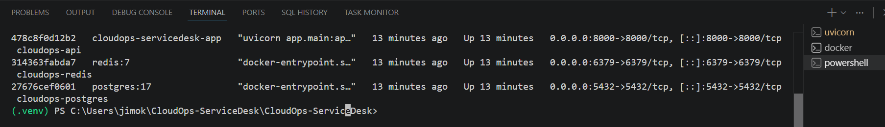

---

## 6.2 Docker Desktop

**Purpose**

Displays Docker Desktop managing the CloudOps ServiceDesk application, confirming that all application containers are running successfully.

**Screenshot**

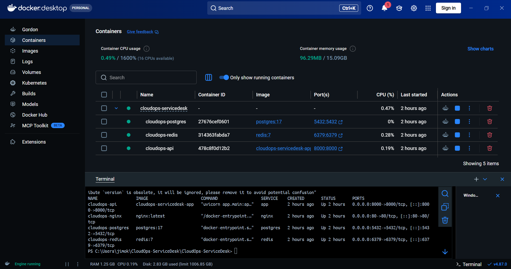

---

## 6.3 Swagger Through Nginx

**Purpose**

Demonstrates that Nginx successfully exposes the FastAPI Swagger documentation through the standard HTTP port, confirming correct reverse proxy configuration.

**Screenshot**

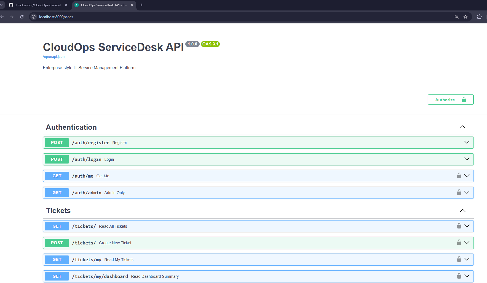

---

## 6.4 Nginx Reverse Proxy

**Purpose**

Demonstrates successful routing of client requests through the Nginx reverse proxy to the FastAPI application, confirming a production-style networking architecture.

**Screenshot**

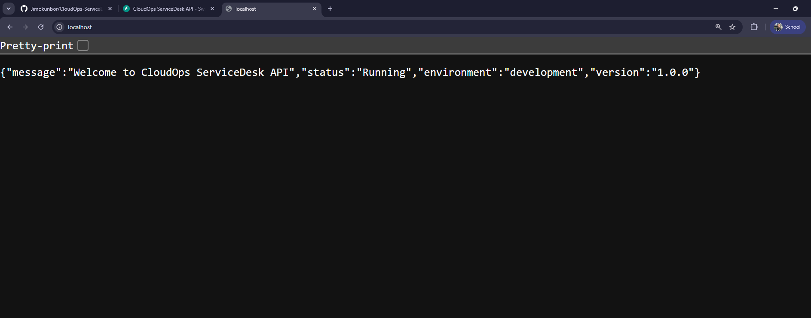

---

## 6.5 Health API Documentation

**Purpose**

Demonstrates the Health API endpoint exposed through the automatically generated OpenAPI (Swagger) documentation. The endpoint provides a standardized mechanism for verifying the operational status of the CloudOps ServiceDesk platform.

**Screenshot**

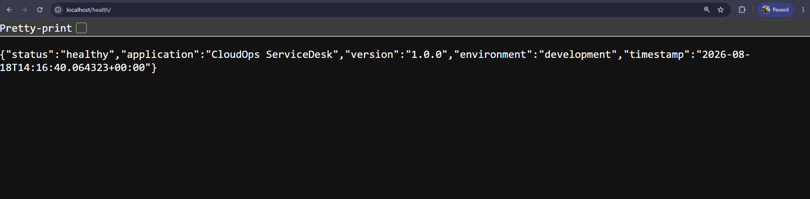

---

## 6.6 FastAPI Health Endpoint

**Purpose**

Demonstrates successful application health verification through the FastAPI service. The endpoint returns the application's operational status, application name, version, deployment environment and current timestamp.

**Screenshot**

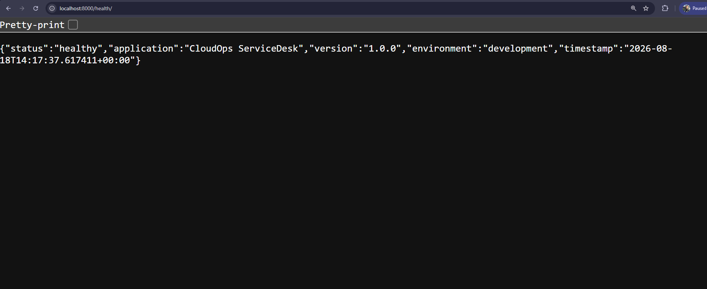

---

## 6.7 Docker Health Check

**Purpose**

Demonstrates Docker's built-in health monitoring successfully verifying the operational status of the FastAPI application. The application container reports a healthy status after executing automated health checks against the `/health` endpoint.

**Screenshot**

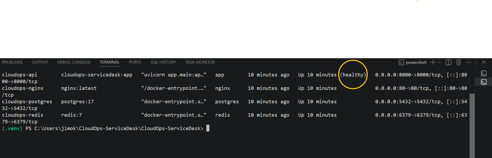

---

## 6.8 Structured Logging

**Purpose**

Demonstrates successful structured application logging. The screenshot confirms that the application generates and writes structured log entries to the `cloudops.log` file, recording application startup, environment information and infrastructure connectivity.

**Screenshot**

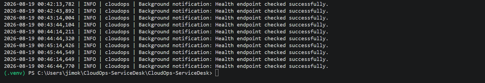

---

## 6.9 Environment Configuration

**Purpose**

Demonstrates successful separation of application environments through dedicated Development and Production configuration modules. This implementation provides a scalable configuration strategy suitable for enterprise deployment.

**Screenshot**

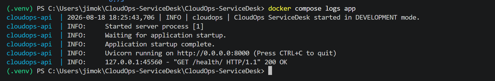

---

## 6.10 Redis Integration

**Purpose**

Demonstrates successful integration of Redis as the platform's in-memory cache and message broker. The application establishes a connection with Redis during startup and confirms service availability.

**Screenshot**

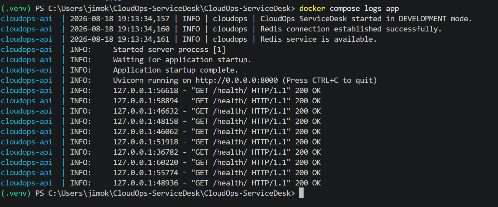

---

## 6.11 Celery Background Processing

**Purpose**

Demonstrates successful asynchronous background task execution using Celery and Redis. The screenshot confirms that notification tasks are dispatched by the FastAPI application, received by the Celery worker, processed successfully and completed without blocking client requests.

**Screenshot**

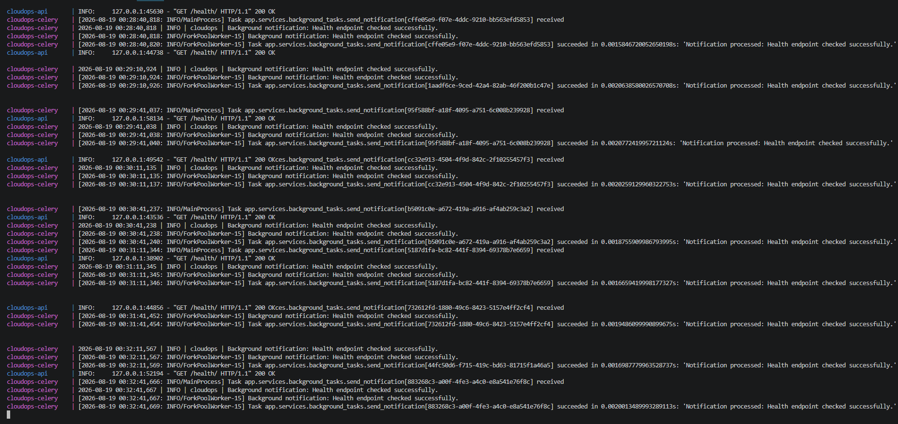

---

## 6.12 Docker Multi-Container Platform

**Purpose**

Demonstrates the complete CloudOps ServiceDesk platform operating as a production-style multi-container environment. The screenshot confirms that FastAPI, PostgreSQL, Redis, Celery and Nginx are all running successfully under Docker Compose.

**Screenshot**

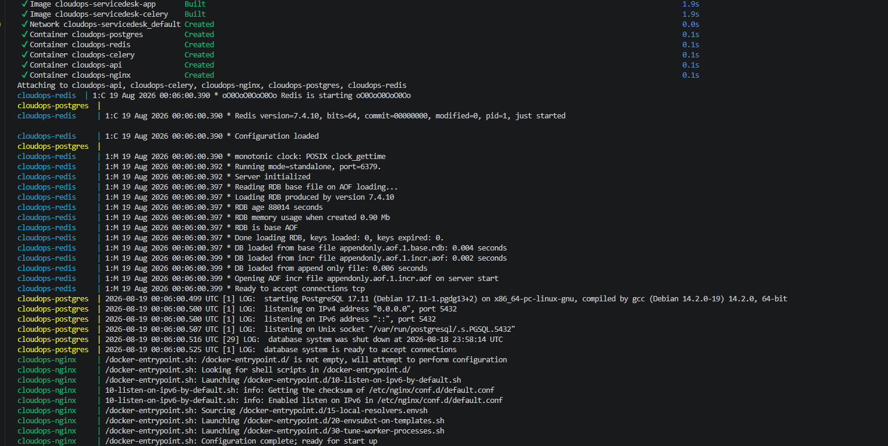

---

## 6.13 AI Service Layer

**Purpose**

Demonstrates integration of enterprise AI services for intelligent ticket analysis, categorization and automation.

**Screenshot**

_To be added after implementation._

---

## 6.14 Terraform

**Purpose**

Demonstrates infrastructure provisioning using Terraform.

**Screenshot**

_To be added after implementation._

---

## 6.15 Ansible

**Purpose**

Demonstrates automated configuration management using Ansible.

**Screenshot**

_To be added after implementation._

---

## 6.16 GitHub Actions

**Purpose**

Demonstrates Continuous Integration (CI) workflow execution using GitHub Actions.

**Screenshot**

_To be added after implementation._

---

## 6.17 Kubernetes

**Purpose**

Demonstrates deployment and orchestration of CloudOps ServiceDesk using Kubernetes.

**Screenshot**

_To be added after implementation._

---

## 6.18 Amazon Web Services (AWS)

**Purpose**

Demonstrates deployment of CloudOps ServiceDesk resources within the AWS cloud environment.

**Screenshot**

_To be added after implementation._

---

## 6.19 Prometheus

**Purpose**

Demonstrates infrastructure and application monitoring using Prometheus.

**Screenshot**

_To be added after implementation._

---

## 6.20 Grafana

**Purpose**

Demonstrates dashboard visualization for infrastructure and application monitoring using Grafana.

**Screenshot**

_To be added after implementation._

---

## 6.21 Loki

**Purpose**

Demonstrates centralized log aggregation and visualization using Loki.

**Screenshot**

_To be added after implementation._

---

## 6.22 Production Deployment

**Purpose**

Demonstrates the final production deployment of CloudOps ServiceDesk.

**Screenshot**

_To be added after implementation._

---

# 7. Screenshot Standards

Every screenshot included in this document should:

- Be clear, readable and high resolution.
- Display only the relevant implementation or completed feature.
- Follow the project's screenshot naming convention.
- Reflect the latest implementation.
- Include a short purpose describing what the screenshot demonstrates.
- Be captured after successful execution or deployment.
- Exclude sensitive information such as passwords, tokens and secret keys.

---

# 8. Related Documentation

- 17-Project-Status.md
- 18-Roadmap.md
- 20-Getting-Started.md

---

# 9. Revision History

| Version | Description |
|----------|-------------|
| 1.0 | Initial screenshots documentation created. |
| 1.1 | Backend Foundation screenshots added. |
| 1.2 | Added Docker Compose, Docker Desktop, PostgreSQL database, Swagger through Nginx and Nginx reverse proxy screenshots. |
| 1.3 | Added Health API documentation and FastAPI Health Endpoint screenshots. |
| 1.4 | Added Docker Health Check, Structured Logging, Environment Configuration, Redis Integration, Celery Background Processing and Docker Multi-Container Platform screenshots. |

---

# 10. Document Status

Actively Maintained